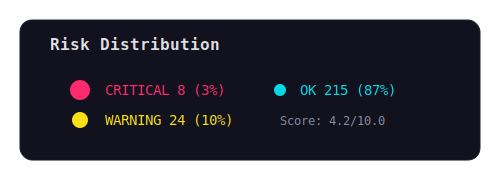
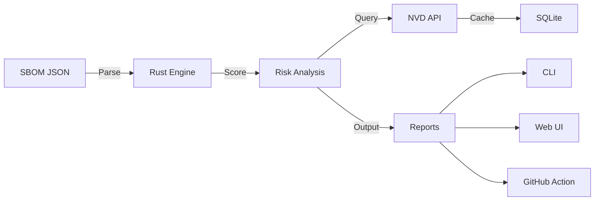

<div align="center">


# ZertTree

> **See the forest through the trees**

[](https://www.rust-lang.org/)
[](https://svelte.dev/)
[](LICENSE)
[](.github/workflows/ci.yml)

**Transform your SBOM into an interactive risk map.**  
*No more unreadable JSON files — see vulnerabilities, license conflicts, and outdated dependencies as a living, breathing graph.*

</div>

---

## What is ZertTree?

<div align="center">


*<sub>Terminal output showing real-time SBOM scanning with CVE detection</sub>*

</div>

ZertTree is a **SBOM Risk Visualizer** that turns your Software Bill of Materials into an interactive, visual experience. Built with Rust for performance and Svelte for the UI.

---

## Features

| Feature | Why it matters |
|---------|---------------|
| **1000+ components/sec** | Rust-powered parsing that handles enterprise-scale SBOMs |
| **CVE Detection** | Real-time NVD API with 24h SQLite cache |
| **Interactive Graph** | D3.js force-directed visualization with live updates |
| **Film Mode** | Auto-rotating camera for demos and presentations |
| **Smart Scoring** | Dev/Prod modes + custom JSON rule sets |
| **CI/CD Ready** | GitHub Action with PR comments |
| **Export Anything** | JSON, HTML, PDF reports |
| **Cyberpunk UI** | Dark theme that looks good at 3 AM |

---

## Quick Start

### CLI

```bash
cargo install zertree
zertree --input sbom.json
```

### Web UI

```bash
cd web-ui
npm install && npm run dev
# http://localhost:5173
```

### GitHub Action

```yaml
- uses: zertannax/zertree-action@v1
  with:
    sbom-path: './sbom.json'
    mode: 'prod'
    fail-on-critical: true
```

---

## Risk Scoring

<div align="center">



*<sub>Live risk distribution with animated severity indicators</sub>*

</div>

### Scoring Factors

| Factor | Weight (Dev) | Weight (Prod) | Rule |
|--------|-------------|---------------|------|
| CVEs | 35% | 50% | Average CVSS score |
| License | 20% | 30% | GPL/AGPL = high risk |
| Freshness | 25% | 10% | >3 years old = risky |
| Maintenance | 20% | 10% | Few contributors = risky |

### Custom Rules

```json
{
  "name": "my-company-rules",
  "cve_weight": 0.40,
  "license_weight": 0.30,
  "blocked_licenses": ["GPL-3.0", "Proprietary"],
  "max_age_months": 12,
  "min_contributors": 2
}
```

---

## Architecture



### Project Structure

```
zertree/
├── rust-parser/     # CLI + parser + scorer (Rust)
├── web-ui/          # Interactive visualization (Svelte + D3.js)
├── github-action/   # GitHub Marketplace action
├── examples/        # Test SBOMs
└── docs/            # Documentation
```

---

## Design System

| Token | Hex | Usage |
|-------|-----|-------|
| Background | `#0A0A0F` | Main background |
| Cyan | `#05D9E8` | OK / Links |
| Pink | `#FF2A6D` | Critical |
| Yellow | `#F7E018` | Warning |

**Fonts**: Space Grotesk (titles), JetBrains Mono (code), Inter (body)

---

## Testing

```bash
# Rust
cd rust-parser && cargo test

# Web
cd web-ui && npm test
```

---

## Contributing

See [CONTRIBUTING.md](docs/CONTRIBUTING.md) for guidelines.

---

## License

MIT

---

<div align="center">

Built with Rust, Svelte, and caffeine

</div>
