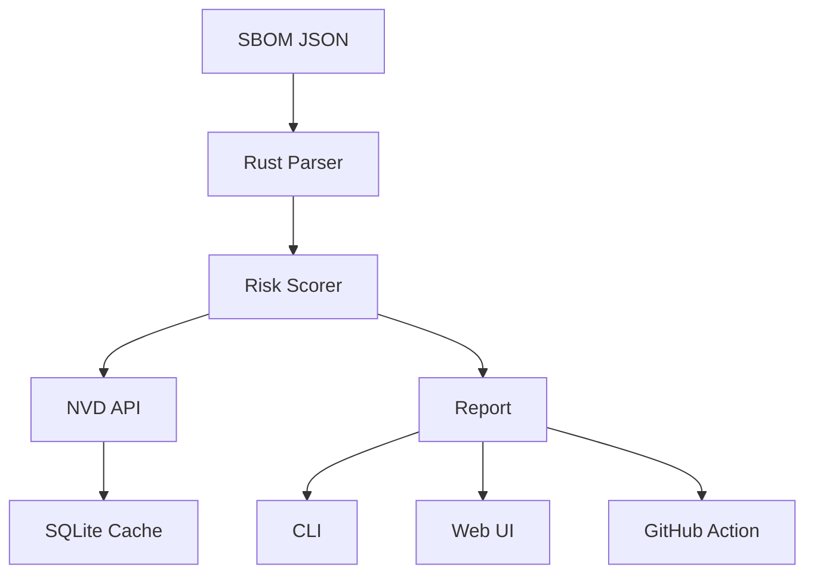

<div align="center">


# 🌳 ZertTree

> **See the forest through the trees**

[](https://www.rust-lang.org/)
[](https://svelte.dev/)
[](LICENSE)
[](.github/workflows/ci.yml)

**Transform your SBOM into an interactive risk map. No more unreadable JSON files — see vulnerabilities, license conflicts, and outdated dependencies as a living, breathing graph.**

</div>

---

## ✨ Features

<div align="center">

| Feature | Description |
|---------|-------------|
| 🔍 **Parse CycloneDX & SPDX** | Native JSON parsing with Rust — 1000+ components in < 1s |
| 🎯 **Risk Scoring** | Configurable rules (Dev/Prod modes + custom JSON) |
| 🕷️ **CVE Detection** | Real-time NVD API integration with local SQLite caching |
| 🌐 **Interactive Graph** | D3.js force-directed visualization with pulsing alerts |
| 🎬 **Film Mode** | Auto-rotating camera for demos and presentations |
| 🔧 **GitHub Action** | CI/CD integration with PR comments |
| 📄 **Export Reports** | JSON, HTML, and PDF outputs |
| ⚡ **Lightning Fast** | Parse 1000+ components in under 1 second |
| 🎨 **Cyberpunk UI** | Dark theme with cyan/pink/yellow accents |

</div>

---

## 🚀 Quick Start

### CLI

```bash
# Install
cargo install zertree

# Scan your SBOM
zertree --input sbom.json --mode dev

# Production mode (stricter rules)
zertree --input sbom.json --mode prod --output json

# Offline mode (skip CVE fetching)
zertree --input sbom.json --offline

# Custom rules
zertree --input sbom.json --rules my-rules.json
```

### Web UI

```bash
cd web-ui
npm install
npm run dev

# Open http://localhost:5173
```

### GitHub Action

```yaml
- uses: zertannax/zertree-action@v1
  with:
    sbom-path: './sbom.json'
    mode: 'prod'
    fail-on-critical: true
```

---

## 📊 Risk Scoring

### Default Rules (Dev Mode)

| Factor | Weight | Rule |
|--------|--------|------|
| CVEs | 35% | Average CVSS score |
| License | 20% | GPL/AGPL = high risk |
| Freshness | 25% | >3 years old = risky |
| Maintenance | 20% | Few contributors = risky |

### Production Mode

Stricter weights with blocked licenses (GPL-3.0, AGPL-3.0, SSPL).

### Custom Rules

```json
{
  "name": "my-company-rules",
  "cve_weight": 0.4,
  "license_weight": 0.3,
  "blocked_licenses": ["GPL-3.0", "Proprietary"],
  "max_age_months": 12,
  "min_contributors": 2
}
```

---

## 🏗️ Architecture



### Project Structure

```
zertree/
├── rust-parser/     # CLI + parser + scorer (Rust)
│   ├── src/
│   │   ├── main.rs        # CLI entry point
│   │   ├── parser.rs      # CycloneDX/SPDX parsing
│   │   ├── scorer.rs      # Risk calculation engine
│   │   ├── cve_fetcher.rs # NVD API client
│   │   └── rules.rs       # Configurable scoring rules
│   └── Cargo.toml
├── web-ui/          # Interactive visualization (Svelte + D3.js)
│   ├── src/
│   │   ├── App.svelte
│   │   └── lib/
│   │       ├── Graph.svelte
│   │       ├── Sidebar.svelte
│   │       ├── Header.svelte
│   │       └── FilmMode.svelte
│   └── package.json
├── github-action/   # GitHub Marketplace action
├── examples/        # Test SBOMs
└── docs/            # Documentation
```

---

## 🎨 Design System

| Token | Hex | Usage |
|-------|-----|-------|
| Background | `#0A0A0F` | Main background |
| Cyan | `#05D9E8` | OK / Links |
| Pink | `#FF2A6D` | Critical |
| Yellow | `#F7E018` | Warning |

**Fonts**: Space Grotesk (titles), JetBrains Mono (code), Inter (body)

---

## 🧪 Testing

```bash
# Rust tests
cd rust-parser
cargo test

# Web tests
cd web-ui
npm test
```

---

## 📸 Demo

<div align="center">

### CLI Output

```
🌳 ZertTree v0.1.0 — Dev Mode
━━━━━━━━━━━━━━━━━━━━━━━━━━━━━━━━━━━━

📦 Parsing SBOM...
✓ Components found: 247

🔍 Fetching CVE data...
Fetching CVEs [████████████████████████████░░░░░░░░] 82%

⚡ Analyzing risks...

┌─────────────────────────────────────────┐
│  RISK DISTRIBUTION                      │
│                                         │
│  🔴 CRITICAL     8 (3%)                 │
│  🟡 WARNING     24 (10%)                │
│  🟢 OK         215 (87%)                │
│                                         │
│  Overall Score:  4.2/10.0               │
└─────────────────────────────────────────┘

⚠️ TOP THREATS:
   1 lodash@4.17.21 → Score: 8.5
      → CVE-2021-23337 (HIGH)
```

### Web Interface

*Interactive D3.js force-directed graph with real-time risk visualization*

</div>

---

## 🤝 Contributing

We welcome contributions! See [CONTRIBUTING.md](docs/CONTRIBUTING.md) for guidelines.

---

## 📜 License

MIT © [Zertannax](https://github.com/zertannax)

---

<div align="center">

🌳 Built with Rust, Svelte, and caffeine

</div>
