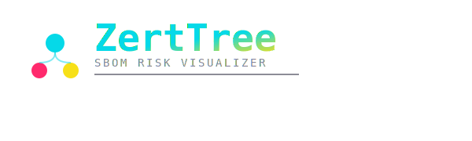
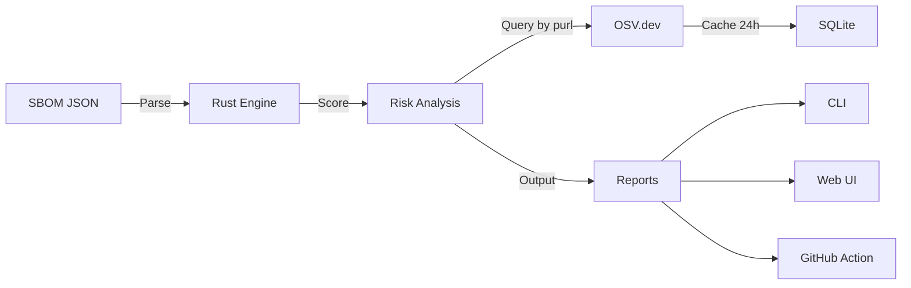

<div align="center">



# ZertTree

> **See the forest through the trees**

[](https://www.rust-lang.org/)
[](https://svelte.dev/)
[](LICENSE)
[](.github/workflows/ci.yml)

**Transform your SBOM into an interactive risk map.**
*Stop reading raw JSON. See vulnerabilities and license conflicts at a glance.*

</div>

---

## What is ZertTree?

<div align="center">


</div>

ZertTree is an **SBOM risk visualizer**. It takes a CycloneDX SBOM, queries
[OSV.dev](https://osv.dev) for known vulnerabilities, scores each component on
CVE severity and license risk, and renders the result as a CLI report, a JSON/HTML
file, or an interactive Svelte + D3.js graph.

> **Status:** early alpha (v0.1.0). The CLI + web UI work end-to-end on CycloneDX
> 1.5 SBOMs. APIs and report formats may change.

---

## Features

| Feature | What it does |
|---------|---------------|
| **CycloneDX 1.5 parser** | Reads CycloneDX JSON SBOMs (component name, version, purl, license). |
| **Vulnerability lookup via OSV.dev** | Queries [OSV.dev](https://osv.dev) by `purl` — no API key needed, accurate per-version. |
| **Local SQLite cache** | Caches OSV responses for 24 h at `$XDG_CACHE_HOME/zertree/cache.db` (or `~/.cache/zertree/cache.db`). |
| **CVE + license scoring** | Two factor scoring (CVE severity + license risk) with `dev` / `prod` presets and custom JSON rules. |
| **Interactive graph** | Svelte + D3.js force-directed visualization (`web-ui/`). |
| **GitHub Action** | Drop-in Docker action that scans an SBOM and posts a PR comment. |
| **JSON / HTML reports** | `--output json` or `--output html` produces a report file. |

### Not implemented yet

The earlier README oversold a few things. To stay honest, here's what is **not**
in v0.1.0:

- **Freshness / maintenance scoring.** Hooks existed but always returned the
  same constant. Removed until they're backed by a real registry lookup.
- **PDF export.** Was advertised, never implemented.
- **`cargo install zertree`.** Not yet on crates.io — build from source for now.
- **`zertannax/zertree-action@v1`.** Not yet published to GitHub Marketplace —
  reference the action by path inside this repo instead.
- **Performance benchmarks.** No "1000+ components/sec" claim is made — none has
  been measured.

PRs to fix any of these are welcome.

---

## Quick Start

### CLI (build from source)

```bash
git clone https://github.com/Zertannax/Zertree.git
cd Zertree/rust-parser
cargo build --release
./target/release/zertree --input ../examples/test-sbom-cyclonedx.json
```

Useful flags:

```bash
zertree --input sbom.json --mode prod          # stricter scoring
zertree --input sbom.json --output json        # writes zertree-report.json
zertree --input sbom.json --offline            # skip OSV lookup
zertree --input sbom.json --no-cache           # bypass the SQLite cache
zertree --input sbom.json --cache /path/to.db  # override cache location
```

### Web UI

```bash
cd web-ui
npm install
npm run dev
# open http://localhost:5173
```

### GitHub Action (from this repo)

```yaml
jobs:
  scan:
    runs-on: ubuntu-latest
    steps:
      - uses: actions/checkout@v4
      - uses: Zertannax/Zertree/github-action@main
        with:
          sbom-path: './sbom.json'
          mode: 'prod'
          fail-on-critical: 'true'
```

---

## Risk Scoring

The final score per component is a weighted sum on a 0–10 scale:

```
score = cve_score * cve_weight + license_risk * license_weight
```

| Factor | Weight (Dev) | Weight (Prod) | Rule |
|--------|:-:|:-:|------|
| CVE severity | 0.60 | 0.70 | Worst CVSS score across all OSV vulns for this `purl`. |
| License risk | 0.40 | 0.30 | MIT/Apache/BSD/ISC = 0; GPL/AGPL/SSPL = 8; blocked = 10; unknown = `license_unknown_score`. |

| Risk level | Score range |
|------------|-------------|
| 🔴 Critical | ≥ 6.0 |
| 🟡 Warning  | 3.0 – 5.99 |
| 🟢 Ok       | < 3.0 |

A single CRITICAL CVE (CVSS ≥ 9.0) is enough to push a component into the
Critical bucket regardless of its license.

### Custom rules

```json
{
  "name": "my-company-rules",
  "cve_weight": 0.70,
  "license_weight": 0.30,
  "blocked_licenses": ["GPL-3.0", "Proprietary"],
  "license_unknown_score": 7.0
}
```

Pass it with `--rules my-rules.json`.

---

## Architecture



### Project Structure

```
zertree/
├── rust-parser/     # CLI + parser + scorer + OSV client (Rust)
├── web-ui/          # Interactive visualization (Svelte + D3.js)
├── github-action/   # Docker-based GitHub Action
├── examples/        # Test SBOMs
└── docs/            # Documentation + assets
```

---

## Design System

| Token | Hex | Usage |
|-------|-----|-------|
| Background | `#0A0A0F` | Main background |
| Cyan | `#05D9E8` | OK / Links |
| Pink | `#FF2A6D` | Critical |
| Yellow | `#F7E018` | Warning |

**Fonts**: Space Grotesk (titles), JetBrains Mono (code), Inter (body)

---

## Testing

```bash
cd rust-parser && cargo test          # 16 unit tests across parser/scorer/cache
cd ../web-ui && npm run build         # smoke build
```

---

## Contributing

See [CONTRIBUTING.md](docs/CONTRIBUTING.md) for guidelines.

---

## License

MIT — see [LICENSE](LICENSE).
