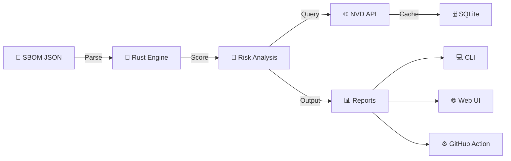

<div align="center">

<!-- Animated Logo SVG -->
<svg width="600" height="180" viewBox="0 0 600 180" xmlns="http://www.w3.org/2000/svg">
  <defs>
    <linearGradient id="logoGrad" x1="0%" y1="0%" x2="100%" y2="100%">
      <stop offset="0%" style="stop-color:#05D9E8;stop-opacity:1">
        <animate attributeName="stop-color" values="#05D9E8;#F7E018;#FF2A6D;#05D9E8" dur="4s" repeatCount="indefinite" />
      </stop>
      <stop offset="50%" style="stop-color:#F7E018;stop-opacity:1">
        <animate attributeName="stop-color" values="#F7E018;#FF2A6D;#05D9E8;#F7E018" dur="4s" repeatCount="indefinite" />
      </stop>
      <stop offset="100%" style="stop-color:#FF2A6D;stop-opacity:1">
        <animate attributeName="stop-color" values="#FF2A6D;#05D9E8;#F7E018;#FF2A6D" dur="4s" repeatCount="indefinite" />
      </stop>
    </linearGradient>
    
    <filter id="glow">
      <feGaussianBlur stdDeviation="3" result="coloredBlur"/>
      <feMerge>
        <feMergeNode in="coloredBlur"/>
        <feMergeNode in="SourceGraphic"/>
      </feMerge>
    </filter>
    
    <style>
      .node { animation: pulse 2s ease-in-out infinite; }
      .node-cyan { animation-delay: 0s; }
      .node-pink { animation-delay: 0.6s; }
      .node-yellow { animation-delay: 1.2s; }
      
      @keyframes pulse {
        0%, 100% { opacity: 0.7; r: 10; }
        50% { opacity: 1; r: 13; }
      }
      
      .connection {
        stroke-dasharray: 5;
        animation: dash 1s linear infinite;
      }
      
      @keyframes dash {
        to { stroke-dashoffset: -10; }
      }
      
      .title {
        font-family: monospace;
        font-size: 48px;
        font-weight: bold;
        fill: url(#logoGrad);
        filter: url(#glow);
      }
      
      .subtitle {
        font-family: monospace;
        font-size: 14px;
        fill: #8A8AA3;
        letter-spacing: 3px;
      }
    </style>
  </defs>
  
  <g transform="translate(40, 40)">
    <circle cx="30" cy="15" r="12" fill="#05D9E8" filter="url(#glow)" class="node node-cyan"/>
    <circle cx="10" cy="50" r="10" fill="#FF2A6D" filter="url(#glow)" class="node node-pink"/>
    <circle cx="50" cy="50" r="10" fill="#F7E018" filter="url(#glow)" class="node node-yellow"/>
    
    <path d="M 30 27 Q 30 40 10 40" stroke="#05D9E8" stroke-width="2" fill="none" class="connection" opacity="0.6"/>
    <path d="M 30 27 Q 30 40 50 40" stroke="#05D9E8" stroke-width="2" fill="none" class="connection" opacity="0.6"/>
    <path d="M 10 60 Q 30 70 50 60" stroke="#F7E018" stroke-width="1.5" fill="none" class="connection" opacity="0.4"/>
  </g>
  
  <text x="120" y="65" class="title">ZertTree</text>
  <text x="120" y="85" class="subtitle">SBOM RISK VISUALIZER</text>
  
  <line x1="120" y1="95" x2="380" y2="95" stroke="#1A1A2E" stroke-width="1"/>
</svg>

<br/><br/>

<!-- Animated Badges -->
<p>
  <a href="https://www.rust-lang.org/"></a>
  <a href="https://svelte.dev/"></a>
  <a href="LICENSE"></a>
  <a href=".github/workflows/ci.yml"></a>
</p>

**Transform your SBOM into an interactive risk map.**  
*No more unreadable JSON files — see vulnerabilities, license conflicts, and outdated dependencies as a living, breathing graph.*

</div>

---

## ⚡ What is ZertTree?

<div align="center">

<svg width="700" height="280" viewBox="0 0 700 280" xmlns="http://www.w3.org/2000/svg">
  <defs>
    <style>
      .terminal-bg { fill: #0A0A0F; }
      .terminal-border { stroke: #1A1A2E; stroke-width: 2; }
      .term-text { font-family: 'JetBrains Mono', 'Courier New', monospace; font-size: 13px; }
      .cyan { fill: #05D9E8; }
      .pink { fill: #FF2A6D; }
      .yellow { fill: #F7E018; }
      .green { fill: #00E676; }
      .white { fill: #E0E0E0; }
      .gray { fill: #6B7280; }
      .cursor {
        animation: blink 1s step-end infinite;
      }
      @keyframes blink {
        50% { opacity: 0; }
      }
      .slide-in {
        animation: slideIn 0.5s ease-out forwards;
        opacity: 0;
      }
      @keyframes slideIn {
        to { opacity: 1; }
      }
    </style>
  </defs>
  
  <rect x="10" y="10" width="680" height="260" rx="8" class="terminal-bg terminal-border"/>
  
  <circle cx="30" cy="25" r="6" fill="#FF5F56"/>
  <circle cx="50" cy="25" r="6" fill="#FFBD2E"/>
  <circle cx="70" cy="25" r="6" fill="#27C93F"/>
  
  <text x="30" y="55" class="term-text cyan slide-in" style="animation-delay: 0s">$</text>
  <text x="45" y="55" class="term-text white slide-in" style="animation-delay: 0.1s">zertree --input sbom.json --mode prod</text>
  
  <text x="30" y="80" class="term-text cyan slide-in" style="animation-delay: 0.5s">🌳</text>
  <text x="55" y="80" class="term-text cyan slide-in" style="animation-delay: 0.6s">ZertTree v0.1.0 — Prod Mode</text>
  
  <text x="30" y="98" class="term-text gray slide-in" style="animation-delay: 0.7s">━━━━━━━━━━━━━━━━━━━━━━━━━━━━━━━━━━━━</text>
  
  <text x="30" y="120" class="term-text white slide-in" style="animation-delay: 0.8s">📦 Parsing SBOM...</text>
  <text x="30" y="138" class="term-text green slide-in" style="animation-delay: 1s">✓ Components found:</text>
  <text x="200" y="138" class="term-text cyan slide-in" style="animation-delay: 1.1s">247</text>
  
  <text x="30" y="160" class="term-text white slide-in" style="animation-delay: 1.3s">🔍 Fetching CVE data...</text>
  <text x="30" y="178" class="term-text green slide-in" style="animation-delay: 1.5s">✓ CVEs fetched:</text>
  <text x="170" y="178" class="term-text yellow slide-in" style="animation-delay: 1.6s">32 vulnerabilities found</text>
  
  <text x="30" y="200" class="term-text white slide-in" style="animation-delay: 1.8s">⚡ Analyzing risks...</text>
  
  <text x="30" y="230" class="term-text pink slide-in" style="animation-delay: 2s">┌─────────────────────────────────────────┐</text>
  <text x="30" y="245" class="term-text pink slide-in" style="animation-delay: 2.1s">│  🔴 CRITICAL    12 (5%)  │  Score: 7.8/10  │</text>
  <text x="30" y="260" class="term-text yellow slide-in" style="animation-delay: 2.2s">│  🟡 WARNING     28 (11%) │                 │</text>
</svg>

</div>

---

## 🎯 Features

<div align="center">

| | Feature | Why it matters |
|---|---|---|
| ⚡ | **1000+ components/sec** | Rust-powered parsing that handles enterprise-scale SBOMs |
| 🔍 | **CVE Detection** | Real-time NVD API with 24h SQLite cache |
| 🎨 | **Interactive Graph** | D3.js force-directed visualization with live updates |
| 🎬 | **Film Mode** | Auto-rotating camera for demos and presentations |
| 📊 | **Smart Scoring** | Dev/Prod modes + custom JSON rule sets |
| 🔧 | **CI/CD Ready** | GitHub Action with PR comments |
| 📄 | **Export Anything** | JSON, HTML, PDF reports |
| 🌙 | **Cyberpunk UI** | Dark theme that looks good at 3 AM |

</div>

---

## 🚀 Get Started

### CLI (One-liner)

```bash
cargo install zertree
zertree --input sbom.json
```

### Web UI

```bash
cd web-ui
npm install && npm run dev
# http://localhost:5173
```

### GitHub Action

```yaml
- uses: zertannax/zertree-action@v1
  with:
    sbom-path: './sbom.json'
    mode: 'prod'
    fail-on-critical: true
```

---

## 🏗️ Architecture

<div align="center">



</div>

### Tech Stack

```
┌─────────────────────────────────────┐
│           ZertTree                  │
├──────────────┬──────────────┬───────┤
│   Rust CLI   │  Svelte UI   │ Action│
│              │              │       │
│ • Parser     │ • D3 Graph   │ • Docker│
│ • Scorer     │ • GSAP Anim  │ • PR Bot│
│ • NVD Client │ • Vite       │       │
│ • SQLite     │              │       │
└──────────────┴──────────────┴───────┘
```

---

## 🎨 The Look

<div align="center">

<svg width="500" height="180" viewBox="0 0 500 180" xmlns="http://www.w3.org/2000/svg">
  <defs>
    <style>
      .glass { fill: rgba(18, 18, 31, 0.8); stroke: #1A1A2E; stroke-width: 1; }
      .dot-crit { fill: #FF2A6D; }
      .dot-warn { fill: #F7E018; }
      .dot-ok { fill: #05D9E8; }
      .pulse-crit { animation: pulseRed 2s ease-in-out infinite; }
      .pulse-warn { animation: pulseYellow 2s ease-in-out infinite; }
      .pulse-ok { animation: pulseCyan 2s ease-in-out infinite; }
      
      @keyframes pulseRed {
        0%, 100% { opacity: 0.6; r: 8; }
        50% { opacity: 1; r: 12; }
      }
      @keyframes pulseYellow {
        0%, 100% { opacity: 0.6; r: 6; }
        50% { opacity: 1; r: 10; }
      }
      @keyframes pulseCyan {
        0%, 100% { opacity: 0.4; r: 5; }
        50% { opacity: 0.8; r: 8; }
      }
    </style>
  </defs>
  
  <rect x="20" y="20" width="460" height="140" rx="12" class="glass"/>
  
  <text x="50" y="50" fill="#E0E0E0" font-family="monospace" font-size="16" font-weight="bold">Risk Distribution</text>
  
  <circle cx="80" cy="90" r="10" class="dot-crit pulse-crit"/>
  <text x="105" y="95" fill="#FF2A6D" font-family="monospace" font-size="14">CRITICAL  8 (3%)</text>
  
  <circle cx="80" cy="120" r="8" class="dot-warn pulse-warn"/>
  <text x="105" y="125" fill="#F7E018" font-family="monospace" font-size="14">WARNING  24 (10%)</text>
  
  <circle cx="280" cy="90" r="6" class="dot-ok pulse-ok"/>
  <text x="300" y="95" fill="#05D9E8" font-family="monospace" font-size="14">OK  215 (87%)</text>
  
  <text x="280" y="125" fill="#8A8AA3" font-family="monospace" font-size="12">Score: 4.2/10.0</text>
  
  <path d="M 420 70 L 440 70 L 450 90 L 430 90 Z" fill="#FF2A6D" opacity="0.3">
    <animate attributeName="opacity" values="0.3;0.8;0.3" dur="1.5s" repeatCount="indefinite"/>
  </path>
</svg>

**Dark theme with cyan, pink, and yellow accents**

</div>

---

## 📊 Risk Scoring Engine

### Dev Mode (Default)

```json
{
  "cve_weight": 0.35,
  "license_weight": 0.20,
  "freshness_weight": 0.25,
  "maintenance_weight": 0.20
}
```

### Prod Mode (Stricter)

```json
{
  "cve_weight": 0.50,
  "license_weight": 0.30,
  "blocked_licenses": ["GPL-3.0", "AGPL-3.0", "SSPL-1.0"]
}
```

### Custom Rules

```json
{
  "name": "my-company-rules",
  "cve_weight": 0.40,
  "license_weight": 0.30,
  "blocked_licenses": ["GPL-3.0", "Proprietary"],
  "max_age_months": 12,
  "min_contributors": 2
}
```

---

## 🧪 Test It

```bash
# Rust
cd rust-parser && cargo test

# Web
cd web-ui && npm test
```

---

## 📜 License

MIT © [Zertannax](https://github.com/zertannax)

---

<div align="center">

<sub>🌳 Built with Rust, Svelte, and caffeine</sub>

</div>
