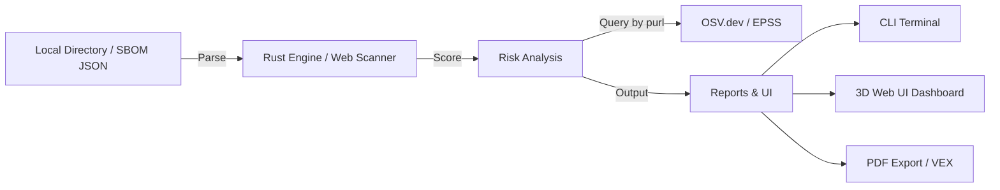

<div align="center">


# ZertTree

> **See the forest through the trees. Enterprise-Grade SBOM Threat Intelligence.**

[](https://www.rust-lang.org/)
[](https://svelte.dev/)
[](LICENSE)
[](.github/workflows/ci.yml)

**Transform your Software Bill of Materials (SBOM) into an interactive, 3D WebGL risk map.**
*Stop reading raw JSON. Experience vulnerability telemetry, VEX triaging, and compliance auditing at a glance.*

</div>

---

## 🌟 What is ZertTree?

ZertTree is a next-generation **SBOM risk visualizer and compliance auditing platform**. Built with a blazing-fast Rust backend and an ultra-modern Svelte WebUI, ZertTree ingests CycloneDX/SPDX SBOMs or **automatically scans your local filesystem**, queries [OSV.dev](https://osv.dev), and maps the transitive risk vectors across your entire dependency tree.

> **Status:** Production-Ready (v1.0.0).

---

## 🚀 Enterprise Features

| Feature | Description |
|---------|-------------|
| **Auto PC Scanner (Zero Install)** | No SBOM? No problem. Use the browser's FileSystem API to natively scan your local project folders. ZertTree builds the SBOM and dependency tree on-the-fly, 100% locally. |
| **Interactive 3D WebGL Telemetry** | Dive into your dependencies through a hardware-accelerated 3D wave mesh representing active risk levels and structural blast radiuses. |
| **Compliance Guardrails Center** | Real-time automated pass/fail compliance audits for **SOC 2 (CC7.1/7.2)**, **ISO 27001 (A.12.6.1)**, **OWASP Top 10**, and Legal License Policies. |
| **VEX (Vulnerability Exploitability eXchange)** | Triage and mute false-positive CVEs. Export your triaged state to ensure your security team only sees actionable threats. |
| **SBOM Differential Engine** | Compare a target SBOM against a baseline to pinpoint added modules, version upgrades, risk score deltas, and introduced/resolved CVEs. |
| **PDF Reporting & Attestation** | Generate beautifully formatted, ink-saving PDF reports and JSON compliance certificates directly from the dashboard. |
| **Global License Inventory** | Dedicated dashboard for legal teams to audit all open-source licenses and their usage frequency across the project. |
| **Actionable Remediation Scripts** | Dynamically generates executable shell patching scripts (`npm`, `cargo`, `pip`) to resolve vulnerable components instantly. |

---

## ⚡ Quick Start

### Web UI (Recommended)

Experience the ultra-dark, glassmorphism UI directly in your browser.

```bash
cd web-ui
npm install
npm run dev
```
👉 Open `http://localhost:5173`
👉 Click **SCAN LOCAL DIRECTORY** to analyze your local projects without uploading anything!

### CLI (Rust Parser)

Process SBOMs natively from your terminal or CI/CD pipelines.

```bash
cd rust-parser
cargo build --release
./target/release/zertree --input ../examples/test-sbom-cyclonedx.json
```

---

## 🛡️ Risk Scoring Engine

The final cascading score per component is a weighted sum on a 0–10 scale:

```
score = cve_score * cve_weight + license_risk * license_weight
```

| Risk Level | Score Range | Description |
|------------|-------------|-------------|
| 🔴 **Critical** | ≥ 6.0 | Contains actively exploited CVEs (CISA KEV) or blocked licenses. |
| 🟡 **Warning**  | 3.0 – 5.99 | Contains elevated risk vulnerabilities or restrictive licenses (e.g., GPL). |
| 🟢 **Secure**   | < 3.0 | Compliant with enterprise security and legal policies. |

*Note: A single CRITICAL CVE (CVSS ≥ 9.0) automatically flags the component as Critical.*

---

## 🏗️ Architecture



---

## 🤝 Contributing
See [CONTRIBUTING.md](docs/CONTRIBUTING.md) for guidelines.

## 📄 License
MIT — see [LICENSE](LICENSE).
